# BOKT Lombard — istifadəçi təlimatı

Bu sənəd sistemin gündəlik ekranlarını izah edir. Yuxarıdakı tarix kompüterin tarixi deyil, bankın **sistem tarixi**dir. Məbləğlər qəpiklə, faizlər dörd rəqəm dəqiqliyi ilə saxlanır.

Sol menyuda yalnız icazəniz olan bölmələr görünür. Admin bütün menyunu görür.

## Giriş

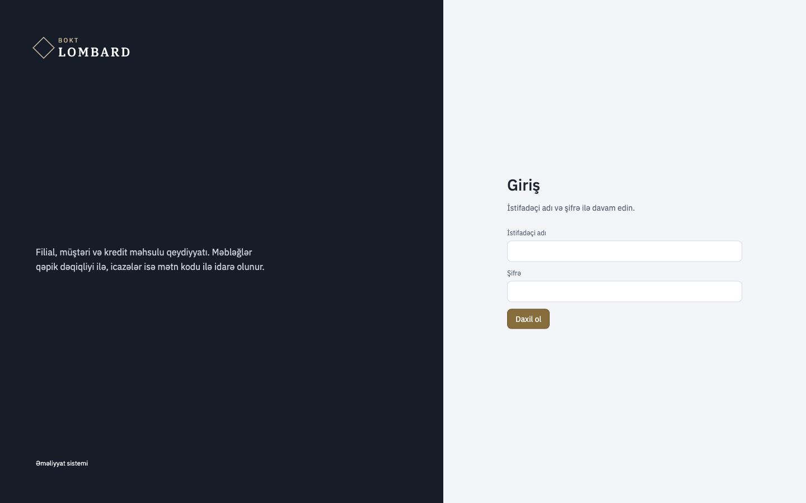

1. İstifadəçi adını və şifrəni yazın.
2. **Daxil ol** düyməsinə basın.

Lokal yoxlama hesabları:

| İstifadəçi | Şifrə | Nə görür |
| --- | --- | --- |
| admin | Admin123! | Bütün bölmələr |
| operator | Operator123! | Əməliyyat menyusu, icazə səhifəsi yoxdur |
| kassir | Kassir123! | Operatorla eyni menyu, kassaya yazma yoxdur |

Səhv şifrə cəhdi sayılır. Limit dolanda hesab kilidlənir. Admin istifadəçi kartında yeni şifrə yazıb **Şifrəni sıfırla və səhv sayını təmizlə** işarəsini qoyaraq hesabı açır. Yeni şifrə ən azı 8 simvol olmalıdır.

Çıxış üçün yuxarı sağdakı **Çıxış** düyməsindən istifadə edin.

## Əməliyyat paneli

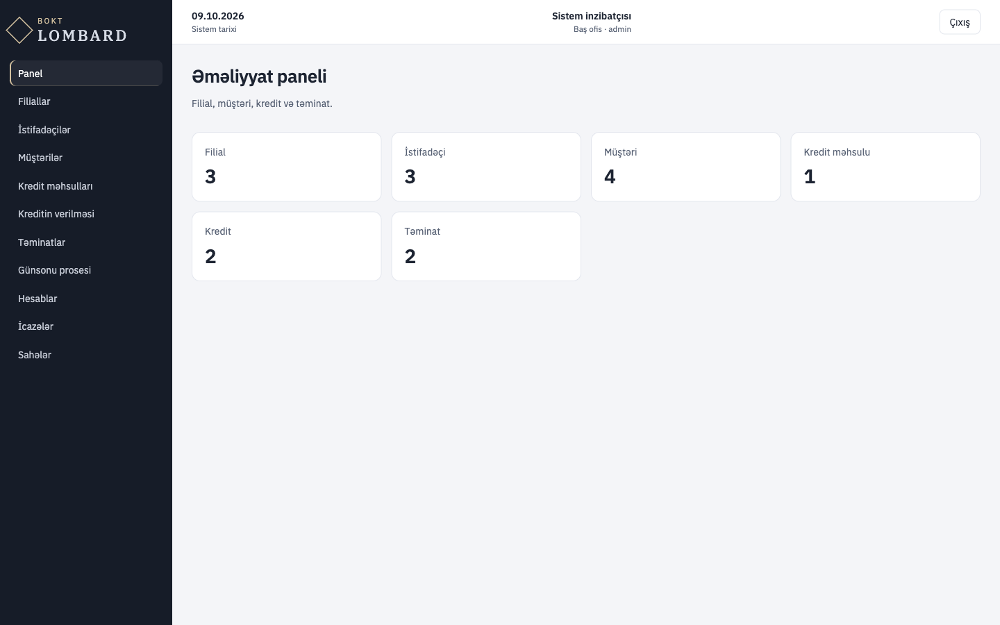

Panel filial, istifadəçi, müştəri, kredit məhsulu, kredit və təminat sayını göstərir. Rəqəmlər bazadakı faktiki saydır.

## Filiallar

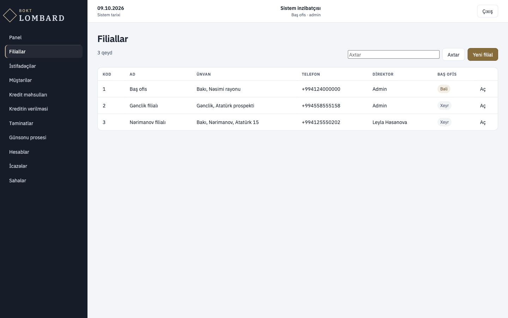

Siyahıda kod, ad, telefon, direktor və ünvan görünür. **Axtar** xanasına ad və ya telefonun bir hissəsini yazıb Enter basın. **Yeni filial** yeni kart açır.

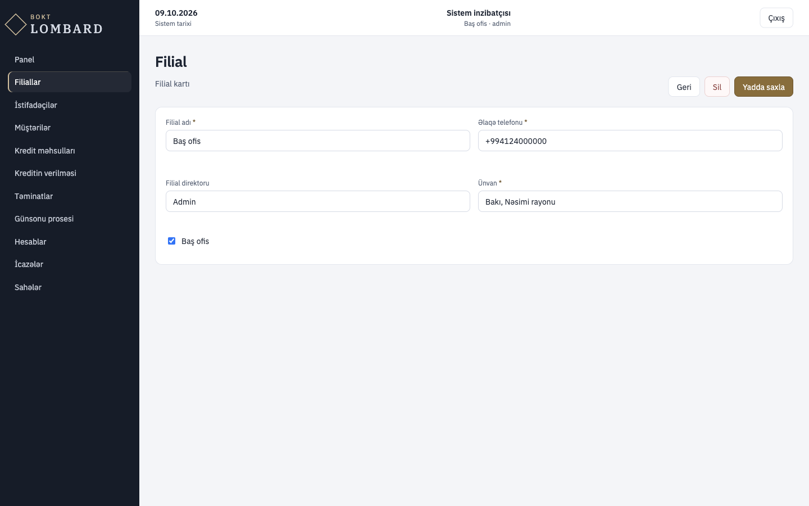

Məcburi sahələr ad, telefon və ünvandır. **Baş ofis** yalnız bir filialda ola bilər: yeni filialı baş ofis etsəniz, əvvəlki baş ofis adi filiala çevrilir.

**Yadda saxla** dəyişikliyi yazır. Yeni kart yaradılandan sonra yaşıl «Yadda saxlandı» yazısı kartın üzərində qalır. **Sil** filialı silir. Kreditə bağlı filial silinmir.

## İstifadəçilər

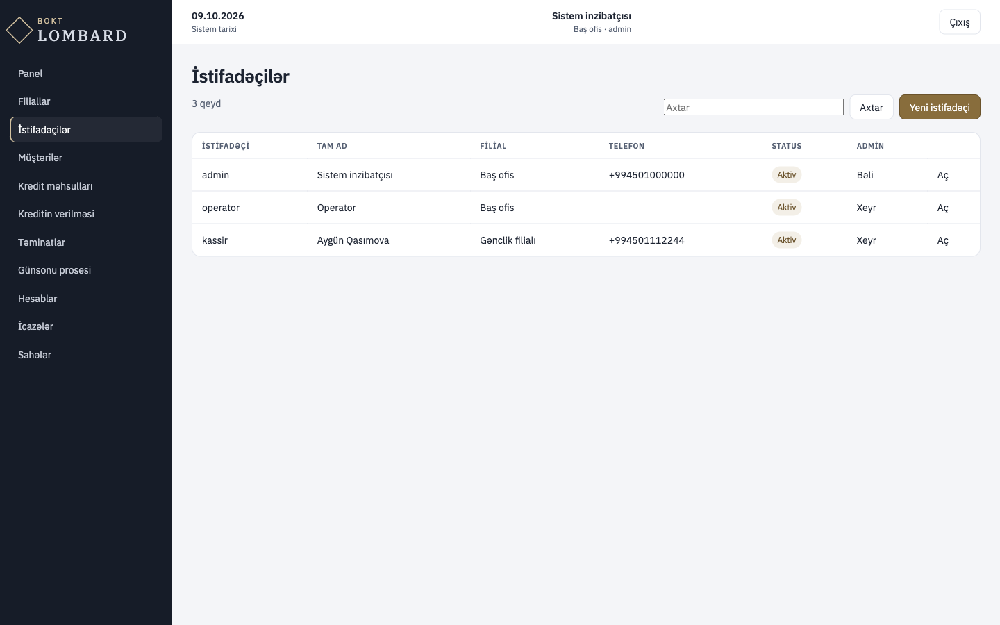

Hər sətir adı, telefonu, filialı, statusu və admin olub-olmadığını göstərir.

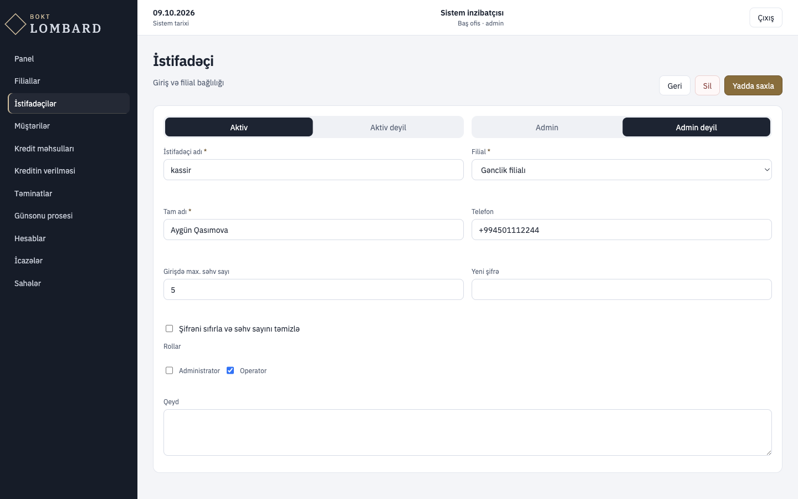

- **Aktiv / Aktiv deyil** — deaktiv istifadəçi girə bilmir.
- **Admin** yalnız admin verə bilər. Admin icazə kodlarından yan keçir.
- İstifadəçi adı 3–32 simvoldur və təkrar oluna bilməz.
- Filial və tam ad məcburidir.
- **Rollar** həmin şəxsin menyusunu müəyyən edir. Məsələn Operator rolu müştəri və kredit yarada bilir, günü bağlaya və krediti kassaya yaza bilmir.
- Öz hesabınızı silə bilməzsiniz.

## Müştərilər

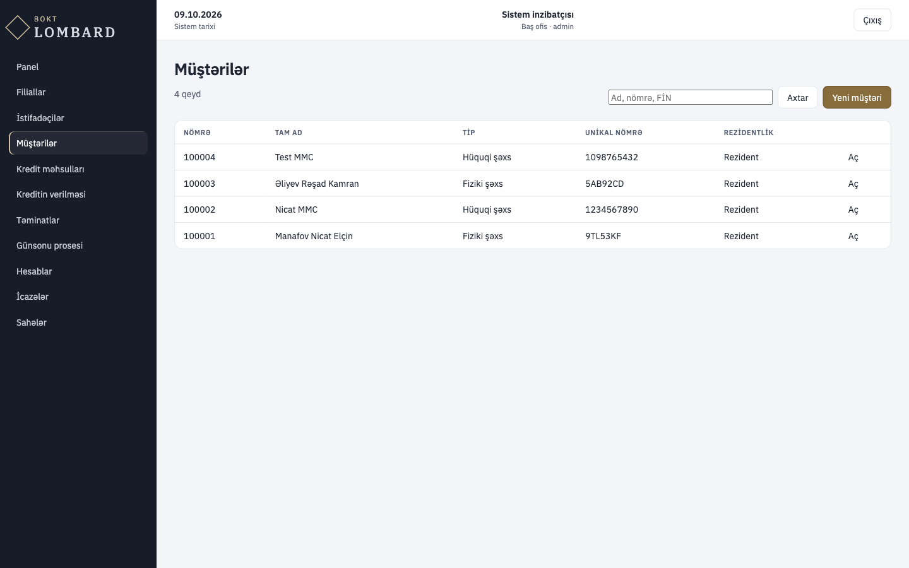

Axtarış ad, müştəri nömrəsi və FİN/VÖEN üzrə işləyir. Yeni fiziki müştəri nömrəsi 100001-dən davam edir.

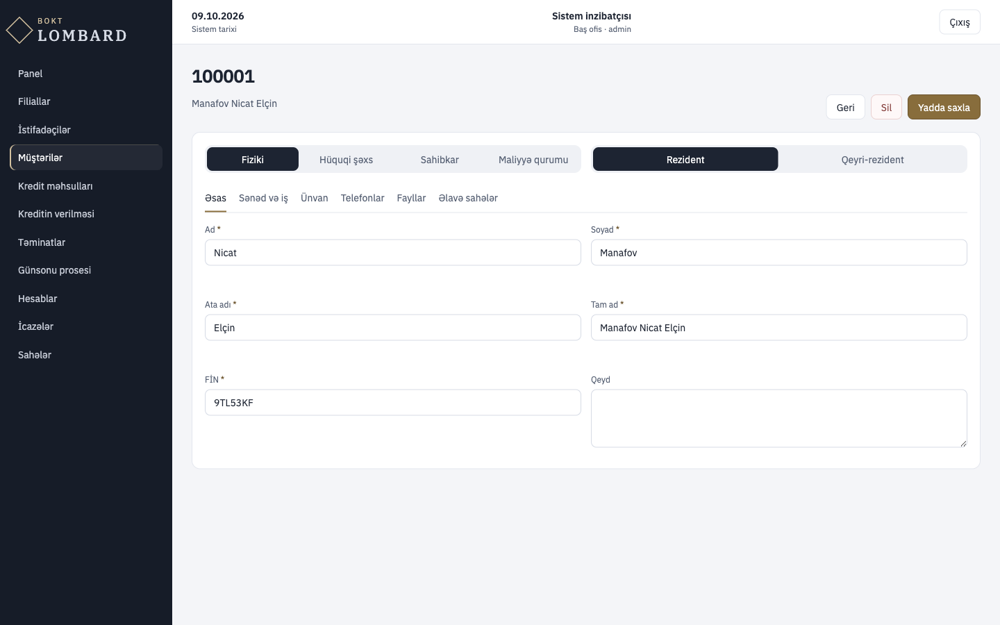

Dörd növ var:

| Növ | Unikal nömrə | Əlavə qayda |
| --- | --- | --- |
| Fiziki | FİN, 7 simvol | Ad, soyad, ata adı və sənəd məcburidir |
| Hüquqi şəxs | VÖEN, 10 rəqəm | Fəaliyyət kodu, sektor və əlaqəli şəxslər |
| Sahibkar | FİN və ya VÖEN | Həm sənəd, həm fəaliyyət kodu və sektor |
| Maliyyə qurumu | VÖEN, 10 rəqəm | Tam ad və ünvan |

Ümumi qaydalar:

- Tam ad həmişə məcburidir. Fiziki və sahibkarda soyad, ad və ata adından özü yığılır.
- Qeydiyyat və faktiki ünvan məcburidir. «Faktiki ünvan qeydiyyat ünvanı ilə eynidir» faktiki ünvanı köçürür.
- Telefon varsa, onlardan yalnız biri əsas ola bilər.
- İş yeri varsa, yalnız biri **Əsas** ola bilər. İki əsas iş yeri saxlanmır.
- Hüquqi şəxsdə təsisçi, icraçı və imzalayan əlavə olunur. Pay yalnız təsisçiyə yazılır və təsisçi paylarının cəmi 100 olmalıdır.
- **Fayllar** səhifəsi kart yadda saxlandıqdan sonra açılır. Fayl tipi yazın, faylı seçin, **Yüklə** basın. Siyahıdakı **Yüklə** həmin faylı geri açır.
- **Əlavə sahələr** dinamik sahələr bölməsində müştəri üçün açdığınız sahələrdir.

## Kredit məhsulları

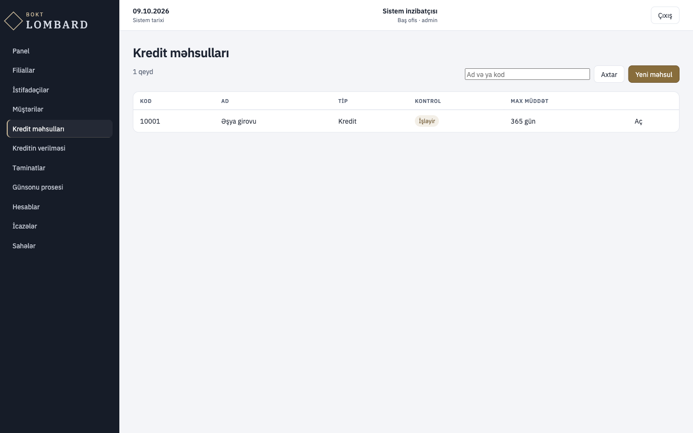

Məhsul kodu boş qalsa növbəti nömrə verilir. Siyahı kodu, adı, kredit tipini və kontrolun işləyib-işləmədiyini göstərir.

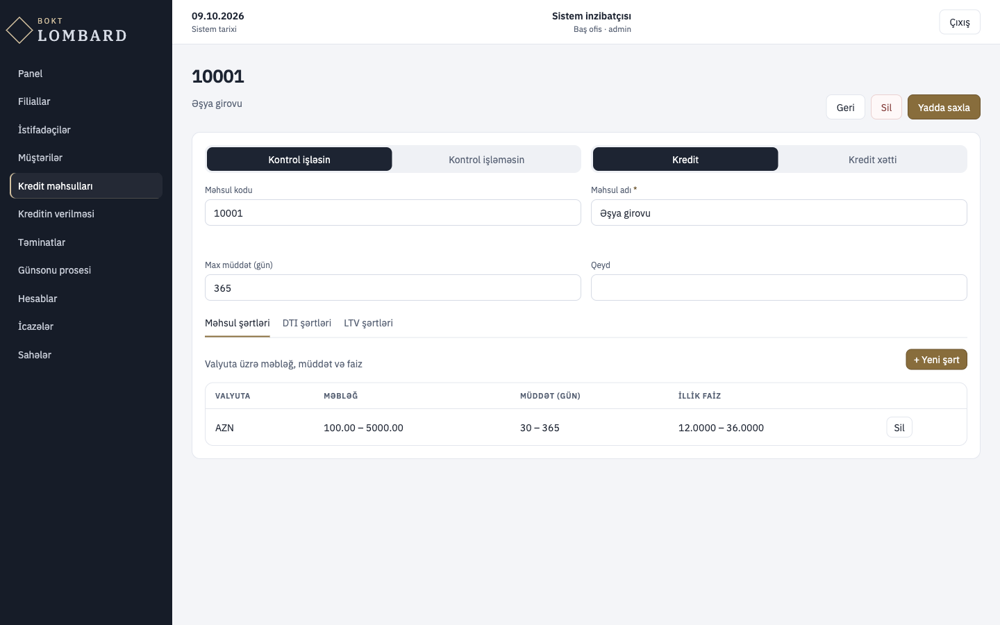

- **Kredit** və ya **Kredit xətti**. Hazırda verilən kredit annuitet qrafiklə işləyir.
- **Kontrol işləsin** olanda məbləğ, müddət və faiz məhsulun şərtinə sığmalıdır. Müddət günlə hesablanır: ay × 30 + əlavə gün, və məhsulun maksimum günündən böyük ola bilməz.
- **Məhsul şərtləri** — valyuta üzrə məbləğ, müddət və illik faiz aralığı. Minimum maksimumdan böyük ola bilməz.
- **DTI şərtləri** — maaş aralığı və yol verilən borc/gəlir faizi. Müştərinin gəliri 0-dırsa bu yoxlama keçilir.
- **LTV şərtləri** — girov növü, kredit valyutası və təminat valyutası üçün limit. Kredit kassaya yazılanda təminat bu limiti örtməlidir.

## Kreditin verilməsi

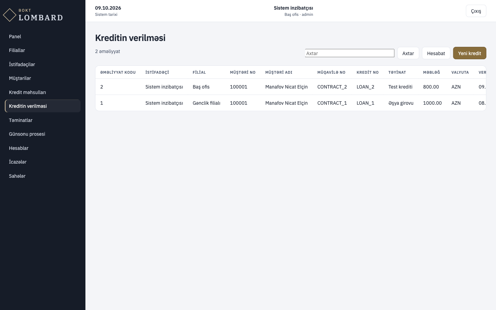

Siyahı üfüqi sürüşür. Əsas sütunlar əməliyyat kodu, istifadəçi, filial, müştəri, müqavilə, kredit nömrəsi, məbləğ, faiz, komissiya, müddət və statusdur. **Axtar** kredit, müqavilə və müştəri nömrəsinə baxır.

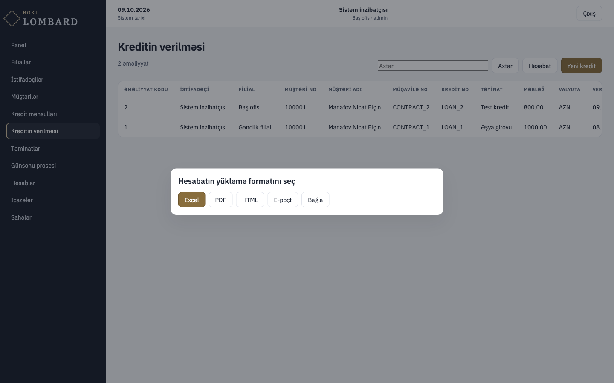

**Hesabat** düyməsi siyahının hazırkı nəticəsini yükləyir:

- **Excel** — nöqtəli vergüllə ayrılmış cədvəl.
- **HTML** — brauzerdə açılan cədvəl.
- **PDF** — çap pəncərəsi. Oradan «PDF kimi saxla» seçin. Pəncərə bloklansa, çap faylı yüklənir.
- **E-poçt** — ünvan soruşur və məktub faylı yükləyir. Onu poçt proqramında açıb göndərin. Sistemin öz poçt serveri yoxdur.

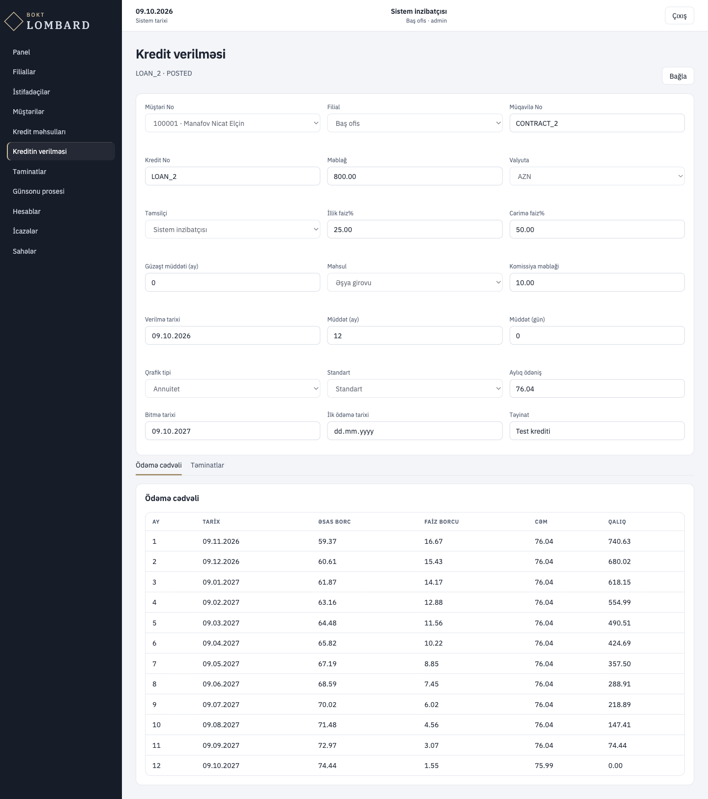

Yeni kreditdə müqavilə və kredit nömrəsi özü gəlir (`CONTRACT_n`, `LOAN_n`). Müştəri, filial, məbləğ, valyuta, illik faiz, cərimə faizi, məhsul, verilmə tarixi və müddət doldurulur. Güzəşt müddəti kredit müddətindən kiçik olmalıdır. Qrafik tipi annuitetdir.

Status **WAITING** olanda kart dəyişir. **Cədvəl yarat** ödəmə cədvəlini qurur:

- Aylıq ödəniş iki qəpiyə qədər yuvarlaqlaşır.
- Güzəşt aylarında əsas borc 0 olur, yalnız faiz yazılır.
- Son sətirdə qalıq 0.00 olur. Son ayın cəmi bir neçə qəpik fərqlənə bilər, çünki qalıq son sətirə yığılır.

**Kassaya yaz** yalnız cədvəl yarandıqdan sonra işləyir. Bundan sonra status **POSTED** olur, məbləğ və şərtlər dəyişmir, kart silinmir. Kassaya yazma icazəsi olmayan istifadəçi bu düyməni görmür.

Məhsul kontrolu açıqdırsa, həddən kənar məbləğ, müddət və faiz saxlanmır. Təminatlar səhifəsindən mövcud təminatı kreditə bağlamaq olar. Bağlanan məbləğ təminatın likvid dəyərindən böyük ola bilməz.

Kassaya yazılış belə keçir: kredit portfelinə debet, kassadan kredit. Komissiya varsa kassadan komissiya gəlirinə yazılır. AZN təminat üçün balansdankənar girov memo-su da keçir.

## Təminatlar

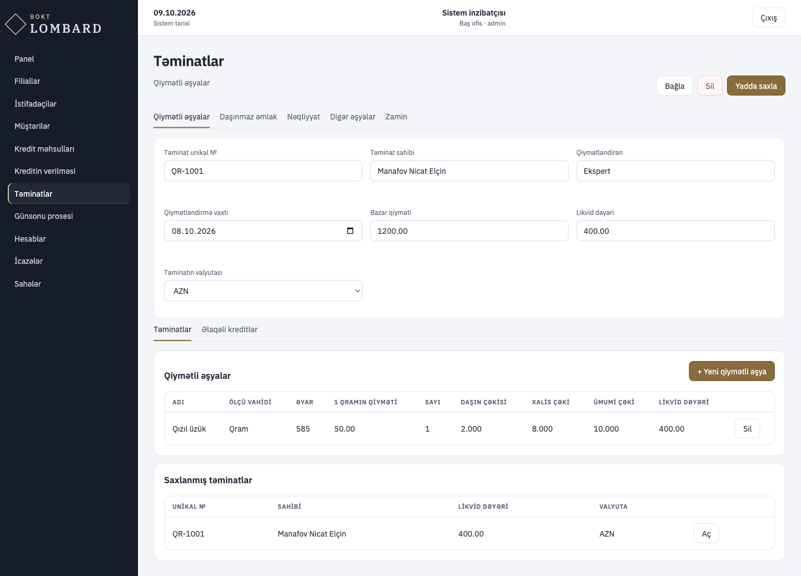

Beş növ var: qiymətli əşyalar, daşınmaz əmlak, nəqliyyat, digər əşyalar və zamin. Hamısında unikal nömrə, sahib, qiymətləndirən, qiymətləndirmə vaxtı, bazar qiyməti, likvid dəyər və valyuta var. Unikal nömrə təkrar ola bilməz.

Qiymətli əşyada sətir əlavə olunur: ad, qram, əyar, bir qramın qiyməti, say, daşın çəkisi, xalis və ümumi çəki. Xalis çəki boşdursa, ümumi çəkidən daşın çəkisi çıxılır. Likvid dəyər boşdursa, xalis çəki qram qiymətinə vurulur. Sayı bu vurmaya qarışmır. Sətirlər olanda kartın likvid dəyəri sətirlərin cəmi olur.

**Əlaqəli kreditlər** səhifəsindən təminatı gözləyən və ya verilmiş kreditə bağlayın. Məbləğ likvid dəyərdən böyük ola bilməz.

Verilmiş kreditə bağlı təminat silinmir. Sistem bunu mətnlə bildirir.

## Günsonu prosesi

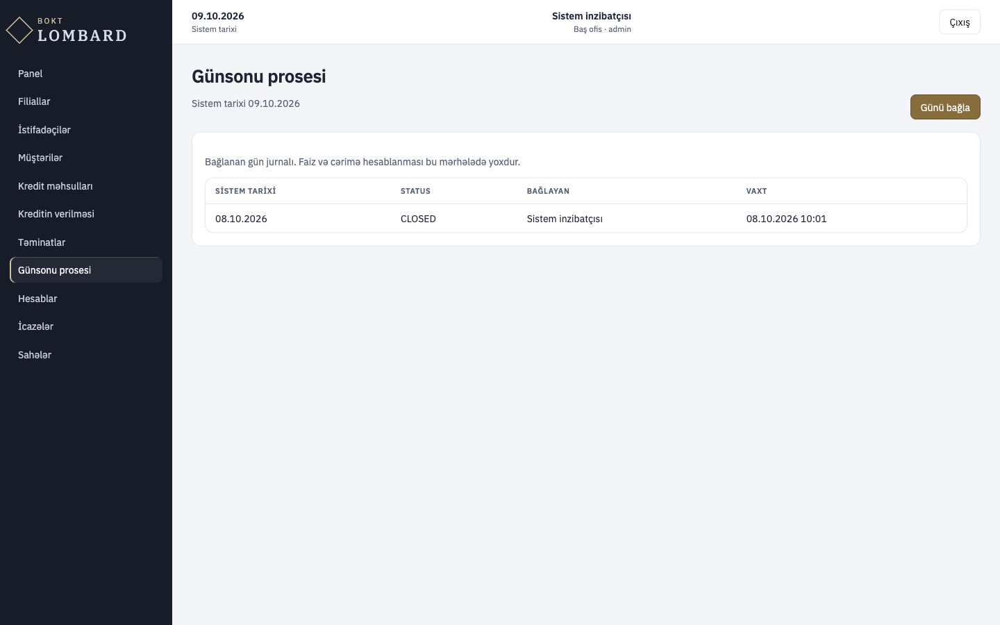

Ekran cari sistem tarixini və bağlanmış günlərin jurnalını göstərir. **Günü bağla** həmin günü `CLOSED` yazır və sistemi növbəti günə keçirir. Bu addım faiz və cərimə hesablamır. Düymə yalnız `eod.run` icazəsi olanda görünür. Eyni gün ikinci dəfə bağlanmır, çünki bağlanandan sonra tarix irəliləyir.

## Hesablar

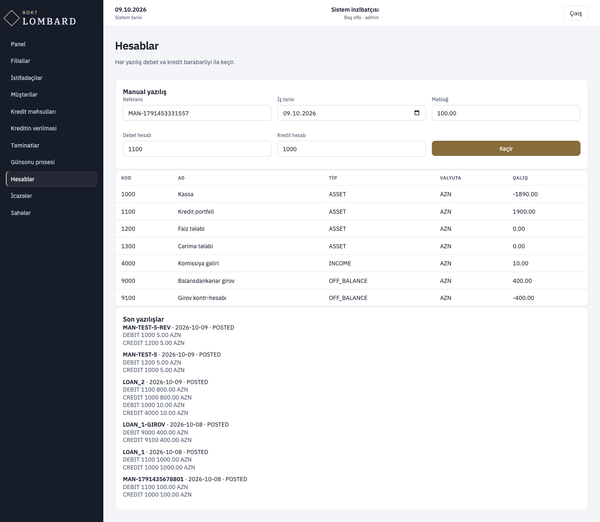

Hər yazılış eyni məbləğdə debet və kreditdən ibarətdir. Ekrandakı qalıqlar:

| Kod | Ad | Mənası |
| --- | --- | --- |
| 1000 | Kassa | Filialın pulu |
| 1100 | Kredit portfeli | Verilmiş kreditlər |
| 1200 | Faiz tələbi | Hesablanacaq faiz |
| 1300 | Cərimə tələbi | Hesablanacaq cərimə |
| 4000 | Komissiya gəliri | Tutulmuş komissiya |
| 9000 | Balansdankənar girov | Girov memo-su |
| 9100 | Girov kontr-hesabı | Girovun əks yazılışı |

Manual yazılışda referans, iş tarixi, məbləğ, debet və kredit hesabı yazılır. İş tarixi açılışda sistem tarixinə bərabər olur. Olmayan hesab rədd edilir. Eyni referansla təkrar basanda məbləğ ikinci dəfə keçmir.

Bu düymə `ledger.post` icazəsi olmayan istifadəçidə gizlənir. Qalıqları görmək üçün `ledger.read` kifayətdir.

## İcazələr

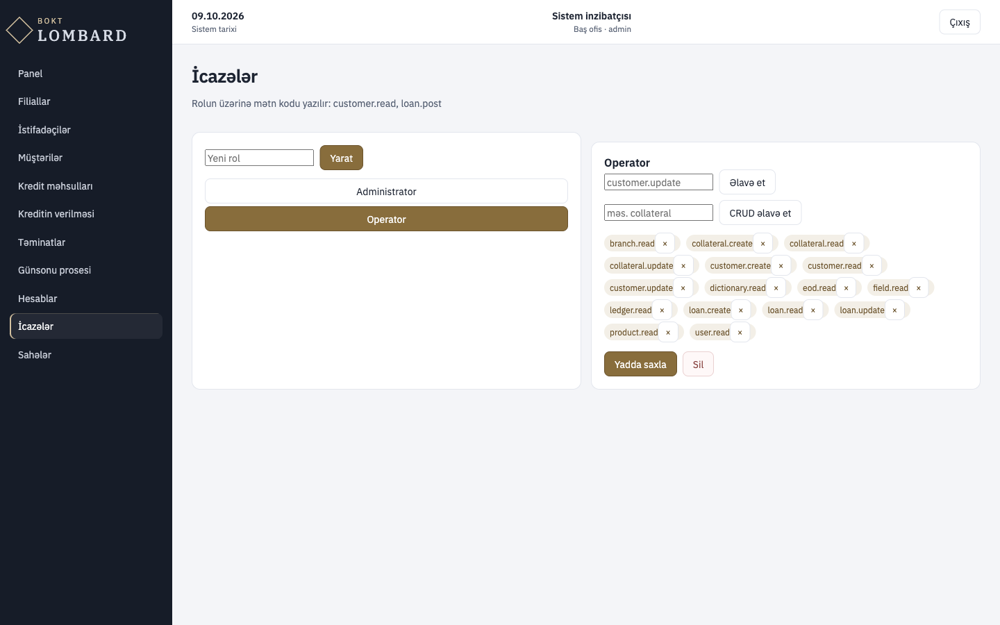

Rolun üzərinə mətn kodu yazılır, məsələn `customer.read` və ya `loan.post`. Kod `modul.əməliyyat` şəklində olmalıdır. Səhv mətn əlavə olunmur.

**CRUD əlavə et** bir resursun create, read, update və delete kodlarını bir dəfəyə yığır. Məsələn `collateral`.

Yadda saxlamadan kod siyahıda qalsa da, bazaya düşmür. İcazəsi olmayan şəxs bu ünvanı birbaşa açsa, panelə qayıdır və «Bu səhifəyə icazəniz yoxdur» görür.

Əsas sərhədlər:

- `loan.post` — krediti kassaya yazır.
- `loan.delete` — gözləyən krediti silir.
- `eod.run` — günü bağlayır.
- `ledger.post` — manual yazılış keçirir.
- `dictionary.manage` və `field.manage` — lüğət və dinamik sahəni dəyişir.

## Dinamik sahələr və lüğətlər

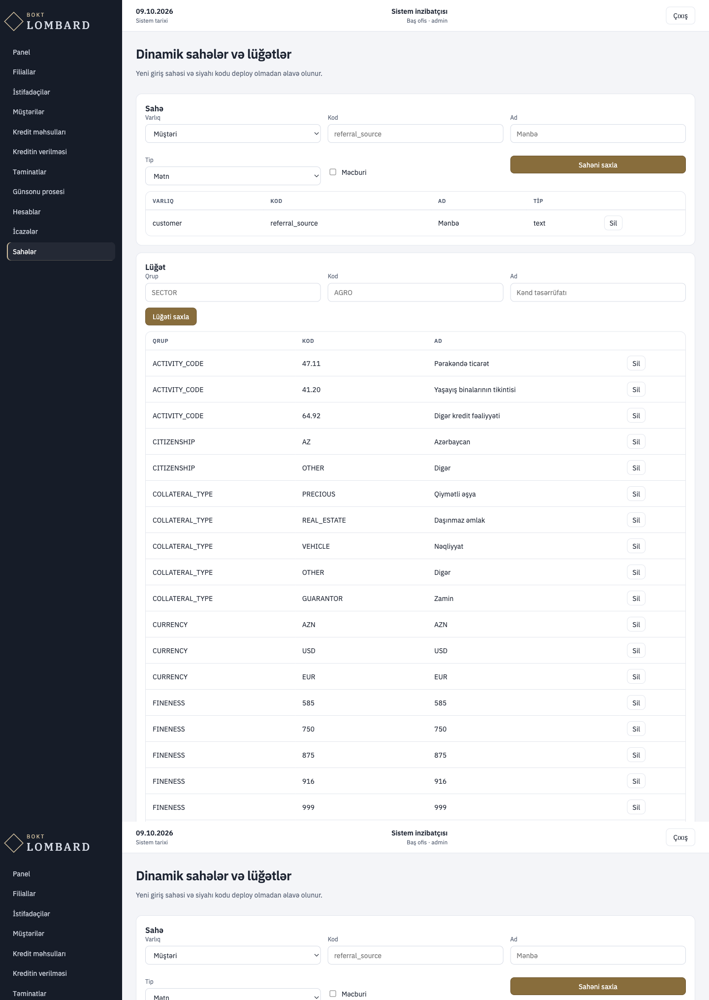

**Sahə** yeni xananı proqram yeniləmədən əlavə edir. Varlıq müştəri, məhsul, filial və ya istifadəçi ola bilər. Kod kiçik latın hərfləri ilə yazılır. Tip mətn, ədəd, məbləğ, tarix və ya bəli/xeyr ola bilər. Məcburi sahə saxlananda boş qala bilməz. Müştəri kartının **Əlavə sahələr** səhifəsində görünür.

**Lüğət** açılan siyahıların kodudur: valyuta, sektor, fəaliyyət kodu, girov növü, əyar, ölçü vahidi və standart. Qrup, kod və ad yazılır. **Sil** kodu siyahıdan çıxarır. Eyni qrup və kodu yenidən saxlasanız, sətir geri qayıdır.
